# BIZRA Architecture Diagrams

> **Visual Reference for Elite Practitioners**  
> Comprehensive architecture views of BIZRA's core systems.

---

## Table of Contents

1. [Bicameral Architecture](#1-bicameral-architecture)
2. [SNR Scoring Pipeline](#2-snr-scoring-pipeline)
3. [Ihsān Ethical Constraint Flow](#3-ihsān-ethical-constraint-flow)
4. [PAT-SAT Protocol Flow](#4-pat-sat-protocol-flow)
5. [Giants Protocol Engine](#5-giants-protocol-engine)
6. [Memory System Hierarchy](#6-memory-system-hierarchy)
7. [Graph-of-Thoughts Reasoning](#7-graph-of-thoughts-reasoning)
8. [End-to-End Pipeline](#8-end-to-end-pipeline)

---

## 1. Bicameral Architecture

The Bicameral Architecture separates cold (cryptographic) and warm (AI) computation with a typed membrane boundary.


### Invariants

| Layer | Responsibility | Cannot |
|-------|---------------|--------|
| ColdCore | Cryptographic proofs, signing, hashing | Access network, call Python |
| Membrane | Type validation, FFI bridging | Store state, skip validation |
| WarmSurface | AI reasoning, memory, agents | Direct crypto operations |

---

## 2. SNR Scoring Pipeline

Signal-to-Noise Ratio (SNR) scoring ensures high-quality reasoning paths.

```mermaid
flowchart LR
    subgraph Input["📥 Input"]
        I1[Raw Content]
        I2[Context Metadata]
    end

    subgraph Analysis["🔬 Analysis"]
        A1["Signal Extraction<br/>(meaningful content)"]
        A2["Noise Detection<br/>(redundancy, fillers)"]
        A3["Context Weighting"]
    end

    subgraph Scoring["📊 Scoring"]
        S1["SNR Calculation<br/>signal / (signal + noise)"]
        S2["Level Classification"]
        S3["Ihsān Cross-Check"]
    end

    subgraph Output["📤 Output"]
        O1["HIGH ≥ 0.8"]
        O2["MEDIUM ≥ 0.5"]
        O3["LOW < 0.5"]
    end

    I1 --> A1
    I2 --> A3
    A1 --> S1
    A2 --> S1
    A3 --> S1
    S1 --> S2
    S2 --> S3
    S3 --> O1
    S3 --> O2
    S3 --> O3

    style O1 fill:#27ae60,stroke:#1e8449,color:#fff
    style O2 fill:#f39c12,stroke:#d68910,color:#fff
    style O3 fill:#e74c3c,stroke:#c0392b,color:#fff
```



### SNR Thresholds

```python
class SNRLevel(Enum):
    HIGH = "HIGH"      # ≥ 0.8 - Premium quality, prioritized
    MEDIUM = "MEDIUM"  # ≥ 0.5 - Acceptable, standard processing
    LOW = "LOW"        # < 0.5 - Filtered or deprioritized
```

---

## 3. Ihsān Ethical Constraint Flow

Ihsān (إحسان) ensures all operations meet ethical excellence threshold ≥ 0.95.


### Fail-Closed Principle

> **Critical**: Ihsān evaluation is **fail-closed**. Unknown inputs default to 0.0 (reject), not 1.0 (accept).

---

## 4. PAT-SAT Protocol Flow

PAT (Prover) constructs proposals; SAT (Verifier) validates and commits.


### Role Separation

| Agent | CAN | CANNOT |
|-------|-----|--------|
| PAT | Construct envelope, sign, pre-validate | Commit, issue receipt |
| SAT | Verify, commit, issue receipt | Construct proposals |

---

## 5. Giants Protocol Engine

Extract wisdom from reasoning traces, standing on the shoulders of giants.


### Wisdom Types

```python
class WisdomType(Enum):
    PATTERN = "pattern"           # Recurring structure
    PRINCIPLE = "principle"       # Guiding rule
    HEURISTIC = "heuristic"       # Practical shortcut
    ANTI_PATTERN = "anti_pattern" # What to avoid
    BRIDGE = "bridge"             # Cross-domain connection
```

---

## 6. Memory System Hierarchy

Four-tier self-evolving memory with SNR-gated promotion.

```mermaid
flowchart TB
    subgraph Tier1["L1: Working Memory"]
        W1["Short-term buffer"]
        W2["Active context"]
        W3["TTL: seconds-minutes"]
    end

    subgraph Tier2["L2: Episodic Memory"]
        E1["Event sequences"]
        E2["Temporal context"]
        E3["TTL: hours-days"]
    end

    subgraph Tier3["L3: Semantic Memory"]
        S1["Extracted knowledge"]
        S2["Concept relationships"]
        S3["TTL: weeks-months"]
    end

    subgraph Tier4["L4: Procedural Memory"]
        P1["Crystallized patterns"]
        P2["Automated skills"]
        P3["TTL: permanent"]
    end

    Tier1 -->|"SNR ≥ 0.6<br/>consolidate"| Tier2
    Tier2 -->|"SNR ≥ 0.7<br/>abstract"| Tier3
    Tier3 -->|"SNR ≥ 0.8<br/>crystallize"| Tier4

    subgraph Retrieval["🔍 Retrieval"]
        R1[Query]
        R2[Semantic Search]
        R3[Results]
    end

    R1 --> R2
    R2 --> Tier1
    R2 --> Tier2
    R2 --> Tier3
    R2 --> Tier4
    Tier1 --> R3
    Tier2 --> R3
    Tier3 --> R3
    Tier4 --> R3

    style Tier1 fill:#3498db,stroke:#2980b9,color:#fff
    style Tier2 fill:#2ecc71,stroke:#27ae60,color:#fff
    style Tier3 fill:#f39c12,stroke:#d68910,color:#fff
    style Tier4 fill:#9b59b6,stroke:#8e44ad,color:#fff
```



### Memory Operations

| Operation | Description |
|-----------|-------------|
| `remember()` | Store new content with auto-tiering |
| `retrieve()` | Semantic search across all tiers |
| `consolidate()` | Promote memories based on SNR |
| `crystallize()` | Extract patterns to L4 |
| `export_to_json()` | Persist to disk |
| `import_from_json()` | Restore from disk |

---

## 7. Graph-of-Thoughts Reasoning

Adaptive beam search with SNR-weighted pruning.

```mermaid
flowchart TB
    subgraph Query["🎯 Query"]
        Q1[Initial Question]
        Q2[Seed Concepts]
    end

    subgraph Exploration["🌳 Tree Exploration"]
        subgraph Depth0["Depth 0"]
            D0A[Concept A]
            D0B[Concept B]
        end
        subgraph Depth1["Depth 1"]
            D1A[A.1]
            D1B[A.2]
            D1C[B.1]
            D1D[B.2]
        end
        subgraph Depth2["Depth 2"]
            D2A[A.1.a]
            D2B[A.2.a]
            D2C[B.1.a]
        end
    end

    subgraph BeamControl["📊 Adaptive Beam"]
        B1["beam_width = base × clarity"]
        B2["SNR-weighted ranking"]
        B3["Low-SNR pruning"]
    end

    subgraph Bridges["🌉 Cross-Domain Bridges"]
        BR1["Analogy Bridge"]
        BR2["Temporal Bridge"]
        BR3["Causal Bridge"]
    end

    subgraph Output["💡 Reasoning Chains"]
        O1[Chain 1: SNR 0.87]
        O2[Chain 2: SNR 0.82]
        O3[Chain 3: SNR 0.79]
    end

    Q1 --> D0A
    Q2 --> D0B
    D0A --> D1A
    D0A --> D1B
    D0B --> D1C
    D0B --> D1D
    D1A --> D2A
    D1B --> D2B
    D1C --> D2C

    D2A --> BeamControl
    D2B --> BeamControl
    D2C --> BeamControl

    BeamControl --> BR1
    BeamControl --> BR2
    BR1 --> O1
    BR2 --> O2
    BR3 --> O3

    style O1 fill:#27ae60,stroke:#1e8449,color:#fff
    style O2 fill:#2ecc71,stroke:#27ae60,color:#fff
    style O3 fill:#f39c12,stroke:#d68910,color:#fff
```



### Beam Width Adaptation

```python
# Clarity-adaptive beam width
current_beam_width = max(1, int(base_beam_width * clarity))

# Prune to current beam width, not base
thoughts = sorted(thoughts, key=lambda t: t.snr_score, reverse=True)
thoughts = thoughts[:current_beam_width]
```

---

## 8. End-to-End Pipeline

Complete flow from user input to verified output.


---

## Legend

| Symbol | Meaning |
|--------|---------|
| ❄️ | Cold computation (cryptographic) |
| 🔥 | Warm computation (AI/ML) |
| 🔀 | Boundary/membrane |
| ✅ | Verification/approval |
| ❌ | Rejection/failure |
| 🔄 | Cyclic/recursive process |
| 📊 | Scoring/metrics |

---

## References

- [PROTOCOL.md](../PROTOCOL.md) - Protocol specification
- [BIZRA_SOT.md](../BIZRA_SOT.md) - Source of Truth
- [SECURITY_MODEL.md](./SECURITY_MODEL.md) - Security architecture
- [VERIFICATION_STANDARD.md](./VERIFICATION_STANDARD.md) - Verification requirements

---

*Generated for BIZRA Genesis Protocol v1.0*
